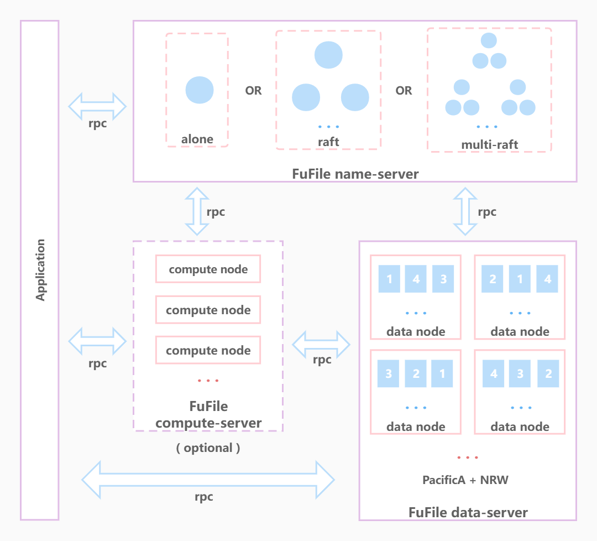

# FuFile

## 简介

FuFile是一款开源的大规模分布式存储系统，可作为文件系统使用，也可作为数据库使用。

## FuFile提供五大核心特性：

+ 高可用

在发生网络故障或部分节点宕机的情况下，只要剩余可用节点数量满足条件，则集群可继续提供服务。

+ 强一致性

只要集群可用，同一时刻，任意客户端总能读取到最新的已提交操作。

+ 容灾

具备机架感知功能，当某个机房出现故障时，其他机房仍可提供服务并且数据不会丢失。

+ 可扩缩容

服务节点在不停机的情况下，可扩容和缩容。

+ 高性能

数据被分成16m大小的块存储，将io压力分散到多个服务节点。

## 链接

[官方网站](https://fufile.org)（施工中）

## 架构

## 开发计划

|Feature|Date|
|:-:|:-:|
|rpc||
|name-server: raft||
|name-server: dir tree&persistence||
|message code generate||
|data-server: PacificA||
|data-server: Quorum NRW||
|data-server: file transfer&persistence||
|name-server-multi-raft||
|compute-server: analysis&compute||

## 贡献

您好，目前项目处于初期，正在全力开发中，感谢关注！

分布式存储系统是一个非常大的项目，涉及rpc、分布式一致协议和内存树等一系列复杂的功能。每一个功能都需要投入大量精力去设计和开发。虽然目前代码量还较少，但是项目严格保证高质量并持续开发。

如果您对此项目感兴趣，欢迎加入，对于新手，可提供一对一指导，您可以收获包括免费正版idea ultimate license、学习设计大型系统的经验和提升技术的深度等等。

河冰结合,非一日之寒；积土成山,非斯须之作。一天很长，一年很短，只要坚持，定会改变原来的人生轨迹。

如果您想参与贡献，请联系作者微信：xuxuffcc

